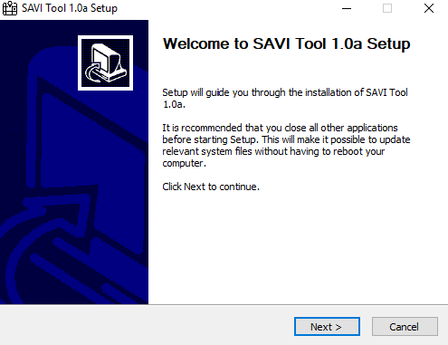
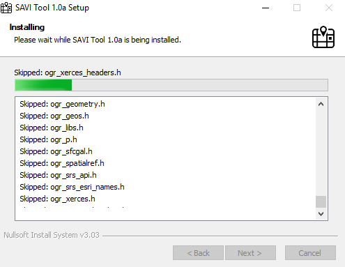
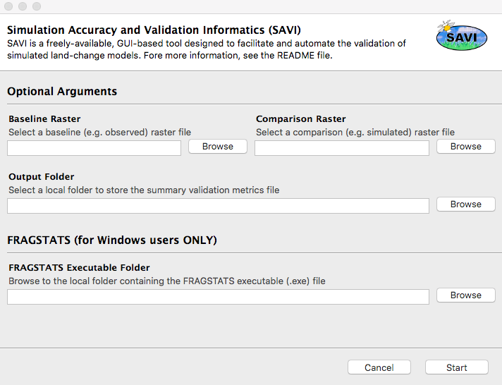
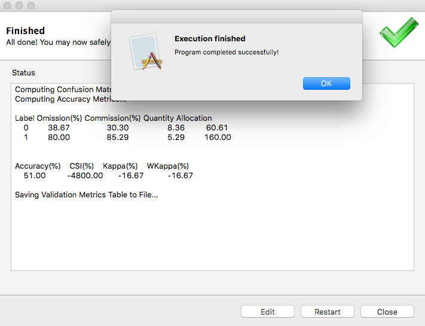
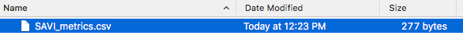

# Simulation Accuracy & Validation Informatics (SAVI)

## About the SAVI Tool

The Simulation Accuracy & Validation Informatics (SAVI) tool is a convenient, freely-available GUI-based tool designed to facilitate and automate the validation of simulated land change models. This tool was developed to address the growing lack of validation assessments conducted following use of land change models to project land cover to future time periods. This tool can be used with any raster and provides multiple accuracy and validation metrics that are well vetted within published literature. Ultimately the choice of which accuracy and validation metric to use is at the discretion of the researcher. The current version of SAVI is made of two main sub-modules: a **_classification accuracy_** metrics module and a **_configuration metrics_** module (relying, at the moment, on the *FRAGSTATS* software). 

**NOTE: the configuration metrics module will only run if you are on a Windows machine and have installed the FRAGSTATS software prior to running the tool (see next section for more details). If you are on a UNIX-like machine, simply do not fill out the FRAGSTATS section of the tool GUI.**

## Getting started

The SAVI tool is easy to use: simply download the executable and save it to a local folder on your machine. The instructions provided below will guide you in validating your land change simulations.

### Prerequisites and Installation:

**Windows users**: you currently have the option of running both **classification accuracy** and **configuration** metrics submodules. If you choose to do so, in addition to downloading the SAVI tool executable file, you must also download and install the [FRAGSTATS](https://www.umass.edu/landeco/research/fragstats/fragstats.html) software. FRAGSTATS is a computer software program designed to compute a wide variety of landscape metrics for categorical map patterns. The original software (version 2) was released in the public domain during 1995 in association with the publication of a USDA Forest Service General Technical Report (McGarigal and Marks, 1995). 

**Linux and Mac OS users**: you currently only have the option to run the **classification accuracy** metrics submodule. When filling out the tool parameters in the GUI, do not complete the FRAGSTATS section.

### Data preparation:

The SAVI tool requires two input raster files: (1) a **baseline** raster map, and (2) a **comparison** raster map. Both must be in TIFF (`.tif`) or IMG (`.img`) formats, with the same **_spatial resolution_** and **_extent_**, and have the same number of grid cells. 

Land cover classes should use integer values beginning with 0. For example, if you have a three class map consisting of *urban*, *undeveloped*, and *forest*, then for both maps the urban class should have value 0, undeveloped class have value 1, and the forest class have value 2. The order of values assigned to each class does not matter, as long as they are consistent between the baseline and comparison maps.

### Installing SAVI (for Windows users)

Find the `SAVI_Tool_1.0a.exe` file inside the *install/nsis* folder. Double-click on it and follow the setup to install the SAVI Tool to your computer.

During the installation, you should see a progress bar similar to the image below, where all necessary libraries and python binaries are installed.

Once the setup is complete, launch the SAVI Tool application from the Windows Start menu.

### Running SAVI

1. Select a baseline (e.g. observed) raster map by clicking on the appropriate `Browse` button. Make sure the raster map has either a `.tif` or `.img` extension. 
2. Select a comparison (e.g. simulated) raster map by clicking on the appropriate `Browse` button. Make sure the raster map has either a `.tif` or `.img` extension.
3. Select an output folder location by clicking on the `Browse` button. Any output file will be saved in this location.
4. **WINDOWS ONLY**: if you wish to calculate configuration metrics, click on the `Browse` button and select the folder location where FRAGSTATS was installed on your machine. For example, under `Program Files (x86)\Fragstats 4`.
5. Click on the `Start` button to execute the SAVI tool. 

**NOTE: execution time heavily depends on the size and resolution of your input raster maps. If the tool does not complete execution within a reasonable time, try subsetting your input data.** 

The output metrics table (`.csv`) is saved into the specified output folder. Open the file to see a summary of all the accuracy metrics computed by the SAVI tool.

## Sample Data

If you would like to test the SAVI Tool using a set of sample data, you can find a *sample_data* folder inside the installation directory on your computer. Provide the appropriate raster files from the sample data folder to the GUI as explained above and test our tool. 

## Version

The current release of the SAVI Tool is **v1.0a** (alpha stage).

## Credits and Contacts

Brian Pickard: <b.r.pickard@gmail.com>

Francesco Tonini: <ftonini84@gmail.com>

## LICENSE

[Apache 2.0](LICENSE)

